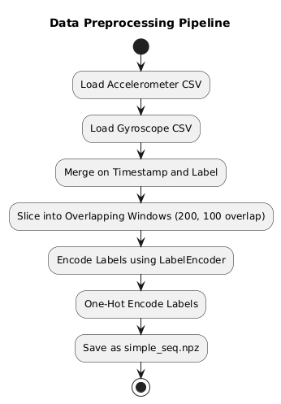
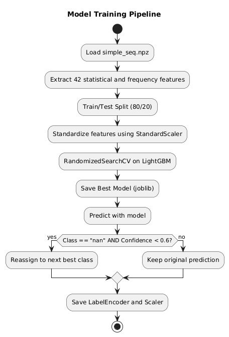

# Heterogeneous HAR: Activity Recognition Pipeline

## Overview
This repository demonstrates a classical feature-based activity recognition system on smartphone & smartwatch sensor data (accelerometer & gyroscope). We extract per-window statistics, train an optimized LightGBM model, and evaluate on 7 classes (‘bike’, ‘sit’, ‘stairsdown’, ‘stairsup’, ‘stand’, ‘walk’, and ‘nan’).

The raw accelerometer & gyroscope recordings used in this project aren’t included in this repo due to size.
**https://www.kaggle.com/datasets/chumajin/heterogeneity-human-activity-recognition-dataset?resource=download**
---

## Pipeline Block Diagram





---

##  Directory Structure
```
activity-tracker/
├─ data/
│  └─ processed/
│     └─ simple_seq.npz       # windowed sequences + one‐hot labels
├─ models/
│  ├─ simple_scaler.joblib    # fitted StandardScaler
│  └─ simple_lgbm_model.joblib# optimized LightGBM model
├─ data_preprocess.py         # create windows & extract raw features
├─ train.py                   # feature‐engineering, RandomizedSearchCV, evaluation
└─ README.md                  # this file
```

---

## Setup & Running
```bash
# 1. Create virtual environment & install dependencies
python -m venv .venv
source .venv/bin/activate  # or .\.venv\Scripts\activate on Windows
pip install -r requirements.txt
cd scripts
# 2. Preprocess raw CSVs into windowed NPZ
python data_preprocess.py

# 3. Train & evaluate model
python train.py
# 4. Convert to onnx for deployment
python onnxmodelconvert.py
```

---

##  Evaluation Metrics

**Classification Report** (Test set):

| Class       | Precision | Recall | F1-Score | Support |
|-------------|----------:|-------:|---------:|--------:|
| bike        |   0.9839  |  0.9830|   0.9834 |    3350 |
| sit         |   0.9806  |  0.9942|   0.9874 |    4126 |
| stairsdown  |   0.9014  |  0.9054|   0.9034 |    2960 |
| stairsup    |   0.9089  |  0.9535|   0.9306 |    3525 |
| stand       |   0.9928  |  0.9947|   0.9938 |    3619 |
| walk        |   0.8434  |  0.9246|   0.8821 |    4533 |
| nan         |   0.8479  |  0.6745|   0.7513 |    3339 |
| **accuracy**|           |        | **0.9225**|   25452 |
| **macro avg**| 0.9227  | 0.9185 |   0.9189|          |
| **weighted avg**|0.9218| 0.9225 |   0.9204|          |

**Confusion Matrix**:

```
[[3293    0    4    6    3    4   40]
 [   0 4102    0    0    0    0   24]
 [   3    0 2680   87    0  104   86]
 [   3    0   49 3361    0   67   45]
 [   1    0    0    0 3600    0   18]
 [   3    0   83   65    0 4191  191]
 [  44   81  157  179   23  603 2252]]
```

---

## Design Justification

- **Classical Feature-Based Approach**  
  We opted for manual extraction of time-domain and frequency-domain statistics rather than an end-to-end deep learning model to keep the pipeline lightweight, interpretable, and easy to debug, as well as to reduce training time and hardware requirements.

- **Window Size (200 samples) & Overlap (100 samples)**  
  A 200-sample window at ~50 Hz (~4 s) captures complete human activity cycles (e.g., walking strides). Overlapping windows (50% overlap) increase effective training samples and smooth transitions between activities.

- **Accelerometer & Gyroscope Fusion**  
  Merging both sensor modalities on timestamp and label leverages complementary motion cues—linear acceleration and rotational velocity—improving class separability, especially for similar activities like stair ascent vs. descent.

- **Label Encoding & One-Hot**  
  Converting string activity labels to integers with `LabelEncoder` and then to one-hot vectors makes them directly usable for both feature engineering (window labeling) and classification, ensuring consistency between preprocessing and model training.

- **Statistical & Frequency Features (42 total per window)**  
  We compute mean, standard deviation, median, interquartile range, zero-crossing rate, and first two moments of the FFT magnitude for each channel to capture both magnitude and periodicity characteristics without manual tuning of filters.

- **Train/Test Split (80/20) & Stratification**  
  An 80/20 split balances training efficiency and evaluation robustness. Stratifying on activity labels ensures all classes—including the underrepresented “nan” class—are proportionally represented in both sets.

- **Feature Scaling with StandardScaler**  
  Standardizing features to zero mean and unit variance prevents channels or features with larger numeric ranges from dominating model learning, improving convergence and generalization.

- **LightGBM Classifier**  
  LightGBM offers fast training, built-in handling of feature interactions, and native support for weighting classes. It consistently delivers high accuracy on tabular data with minimal hyperparameter tuning.

- **RandomizedSearchCV for Hyperparameter Tuning**  
  We use randomized search over a broad hyperparameter space with cross-validation to efficiently find a high-performing model configuration without exhaustively searching every combination.

- **Class-Specific Confidence Threshold for “nan”**  
  Applying a 0.6 threshold on the “nan” class probability ensures we only assign “nan” when the model is confident, reducing false positives by reassigning uncertain predictions to the next likely class.

- **Artifact Persistence (joblib)**  
  Saving the fitted `StandardScaler`, `LabelEncoder`, and the final LightGBM model guarantees reproducibility, allows easy deployment, and simplifies downstream conversion (e.g., to ONNX or Core ML).
